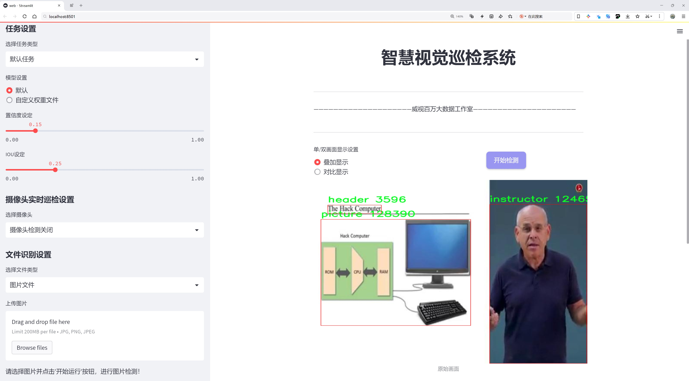
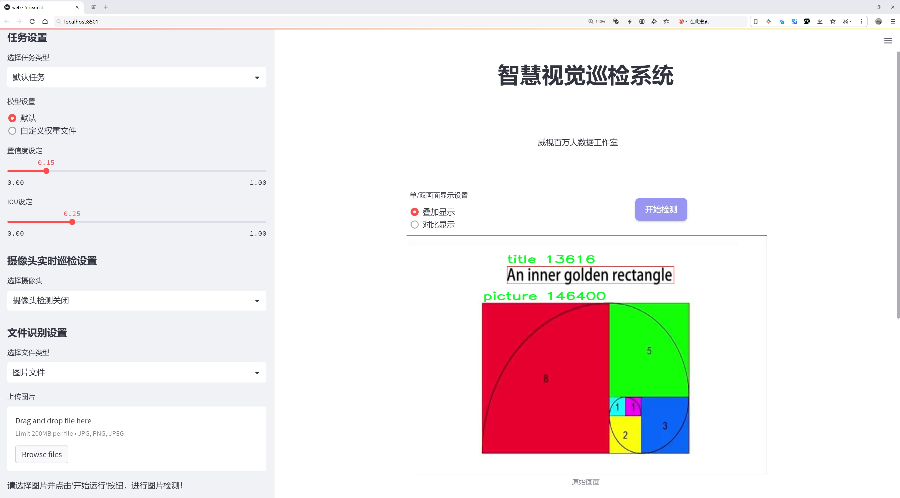
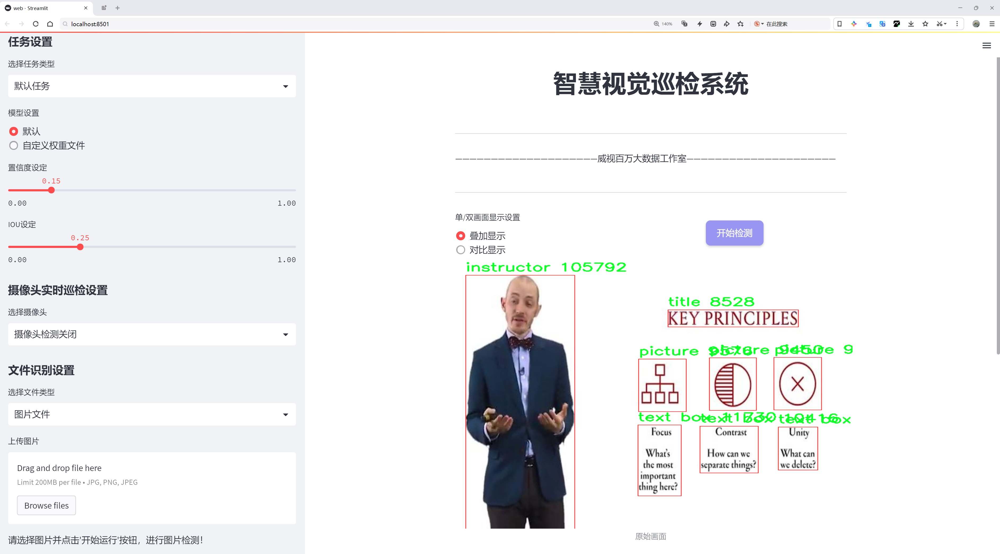
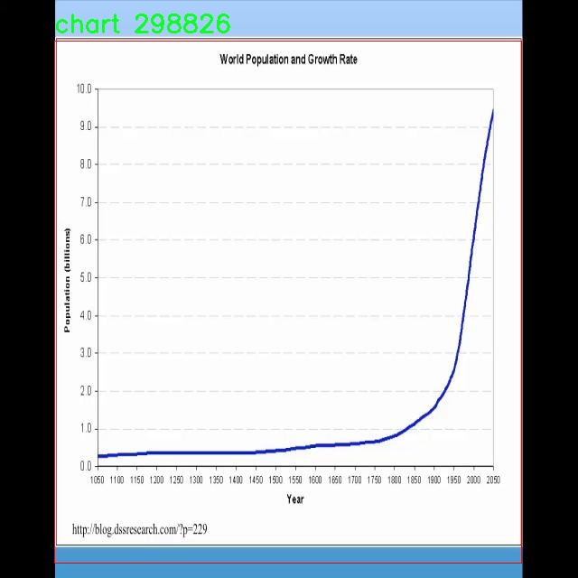
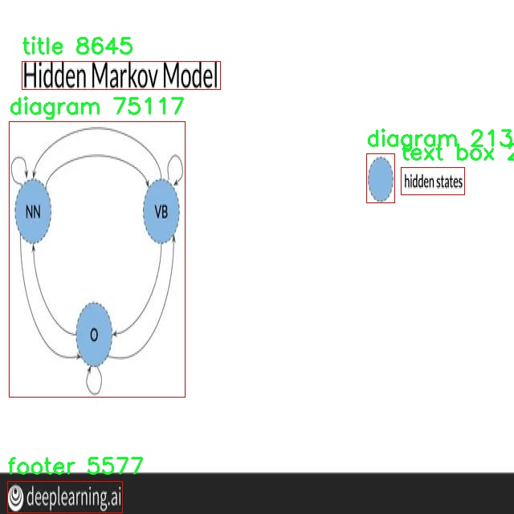
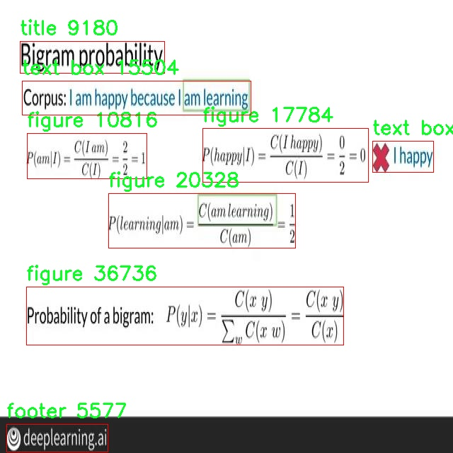
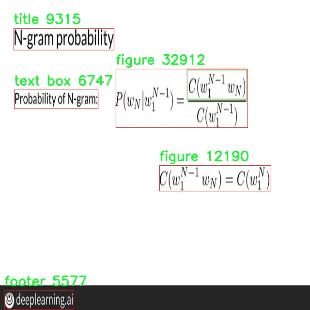
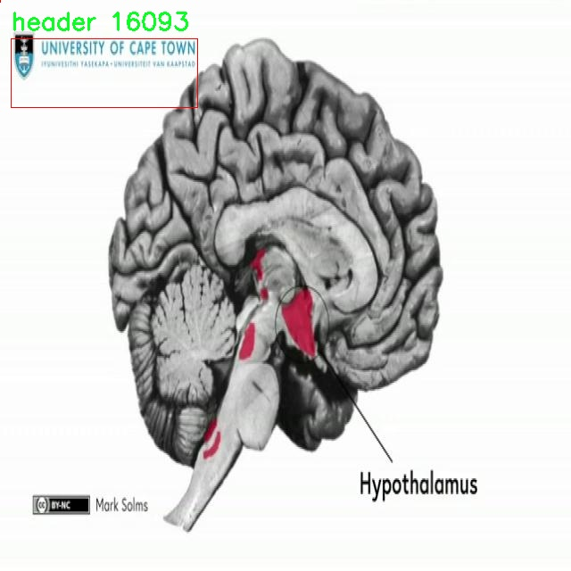

# 教育材料内容检测检测系统源码分享
 # [一条龙教学YOLOV8标注好的数据集一键训练_70+全套改进创新点发刊_Web前端展示]

### 1.研究背景与意义

项目参考[AAAI Association for the Advancement of Artificial Intelligence](https://gitee.com/qunshansj/projects)

项目来源[AACV Association for the Advancement of Computer Vision](https://gitee.com/qunmasj/projects)

研究背景与意义

随着信息技术的迅猛发展，教育领域的数字化转型已成为不可逆转的趋势。教育材料的丰富性和多样性为教学提供了更为广阔的视野，但同时也带来了内容管理和信息检索的挑战。传统的教育材料通常以文本和图像的形式呈现，如何有效地对这些内容进行分类、识别和管理，成为教育技术研究的重要课题。在此背景下，基于深度学习的目标检测技术逐渐受到关注，尤其是YOLO（You Only Look Once）系列模型因其高效性和实时性而被广泛应用于各类视觉识别任务。

YOLOv8作为YOLO系列的最新版本，具备了更强的特征提取能力和更高的检测精度，能够在复杂场景中实现快速而准确的目标检测。通过对教育材料中不同类型内容的自动识别与分类，YOLOv8能够为教育工作者提供有效的支持，帮助他们快速找到所需的教学资源，提升教学效率。此外，教育材料的内容检测系统还可以为教育研究提供数据支持，促进教育内容的分析与优化。

本研究旨在基于改进的YOLOv8模型，构建一个高效的教育材料内容检测系统。该系统将针对特定的教育材料数据集进行训练与测试，该数据集包含5500张图像，涵盖了13个类别，包括图表、图示、插图、手写内容、标题等。这些类别不仅反映了教育材料的多样性，也为系统的准确性和实用性提供了丰富的基础。通过对这些类别的有效识别，系统能够实现对教育材料的智能化管理，帮助教师和学生快速获取所需信息，进而提升学习效果。

此外，随着教育信息化的不断推进，教育材料的数字化存储和管理变得愈发重要。传统的手动分类和检索方式不仅耗时耗力，而且容易出现错误。基于YOLOv8的教育材料内容检测系统能够实现自动化的内容识别和分类，大大提高了工作效率。同时，该系统的应用也有助于教育资源的共享与再利用，推动教育公平的发展。

在全球范围内，教育资源的有效利用和管理已成为各国教育改革的重要目标。通过构建基于改进YOLOv8的教育材料内容检测系统，本研究不仅为教育工作者提供了实用的工具，也为教育技术的研究提供了新的思路和方法。随着教育材料的不断增加，如何利用先进的技术手段进行有效管理和利用，将是未来教育研究的重要方向。

综上所述，本研究的开展具有重要的理论意义和实践价值。通过对教育材料内容的智能检测与分类，不仅能够提升教育工作者的工作效率，也为教育资源的优化配置提供了数据支持，进而推动教育信息化的深入发展。希望本研究能够为教育领域的技术创新和应用提供有益的参考与借鉴。

### 2.图片演示







##### 注意：由于此博客编辑较早，上面“2.图片演示”和“3.视频演示”展示的系统图片或者视频可能为老版本，新版本在老版本的基础上升级如下：（实际效果以升级的新版本为准）

  （1）适配了YOLOV8的“目标检测”模型和“实例分割”模型，通过加载相应的权重（.pt）文件即可自适应加载模型。

  （2）支持“图片识别”、“视频识别”、“摄像头实时识别”三种识别模式。

  （3）支持“图片识别”、“视频识别”、“摄像头实时识别”三种识别结果保存导出，解决手动导出（容易卡顿出现爆内存）存在的问题，识别完自动保存结果并导出到tempDir中。

  （4）支持Web前端系统中的标题、背景图等自定义修改，后面提供修改教程。

  另外本项目提供训练的数据集和训练教程,暂不提供权重文件（best.pt）,需要您按照教程进行训练后实现图片演示和Web前端界面演示的效果。

### 3.视频演示

[3.1 视频演示](https://www.bilibili.com/video/BV1mjtpeBEjx/)

### 4.数据集信息展示

##### 4.1 本项目数据集详细数据（类别数＆类别名）

nc: 12
names: ['chart', 'diagram', 'figure', 'footer', 'handwriting', 'header', 'instructor', 'picture', 'schematic diagram', 'table', 'text box', 'title']


##### 4.2 本项目数据集信息介绍

数据集信息展示

在现代教育领域，随着数字化教学材料的普及，如何有效地识别和分析这些材料中的信息成为了一个重要的研究课题。为此，我们构建了一个名为“lect_design1”的数据集，旨在为改进YOLOv8的教育材料内容检测系统提供支持。该数据集专注于教育材料中的多种视觉元素，涵盖了12个不同的类别，能够帮助系统更好地理解和解析教学内容的结构与形式。

“lect_design1”数据集的设计初衷是为了提升机器学习模型在教育材料中的应用能力，尤其是在内容识别和信息提取方面。数据集中包含的类别包括：图表（chart）、图解（diagram）、插图（figure）、页脚（footer）、手写文字（handwriting）、页眉（header）、讲师（instructor）、图片（picture）、示意图（schematic diagram）、表格（table）、文本框（text box）以及标题（title）。这些类别不仅涵盖了教育材料中常见的视觉元素，还反映了教学内容的多样性和复杂性。

每个类别在数据集中都有丰富的样本，确保了模型在训练过程中能够接触到各种不同的实例。例如，图表和表格类样本提供了数据可视化的案例，帮助模型学习如何识别和解析数据关系；而手写文字和讲师图像则增强了模型对人类互动和个性化教学内容的理解能力。通过对这些不同类别的学习，YOLOv8能够更准确地识别出教育材料中的关键元素，从而为用户提供更为精准的内容分析和反馈。

此外，数据集的构建过程中，我们特别注重样本的多样性和代表性。每个类别的样本都来源于不同的教育场景和材料类型，包括在线课程、教材、教学幻灯片等。这种多样性确保了模型在实际应用中能够适应不同的教学环境和材料格式，提升了其泛化能力和实用性。

在数据标注方面，我们采用了严格的标注标准，确保每个样本的类别标签准确无误。标注团队由教育领域的专家和数据科学家组成，他们不仅具备丰富的教育背景，还熟悉计算机视觉技术。这种跨学科的合作为数据集的质量提供了有力保障，使得“lect_design1”成为一个高质量的训练资源。

总之，“lect_design1”数据集为改进YOLOv8的教育材料内容检测系统提供了坚实的基础。通过对多种视觉元素的深入学习，模型将能够更好地理解教育材料的结构与内容，从而为教育工作者和学习者提供更为精准和高效的支持。随着数据集的不断完善和模型的持续优化，我们期待在教育领域实现更为智能化的内容识别与分析，推动教育技术的进一步发展。











### 5.全套项目环境部署视频教程（零基础手把手教学）

[5.1 环境部署教程链接（零基础手把手教学）](https://www.ixigua.com/7404473917358506534?logTag=c807d0cbc21c0ef59de5)


[5.2 安装Python虚拟环境创建和依赖库安装视频教程链接（零基础手把手教学）](https://www.ixigua.com/7404474678003106304?logTag=1f1041108cd1f708b01a)

### 6.手把手YOLOV8训练视频教程（零基础小白有手就能学会）

[6.1 手把手YOLOV8训练视频教程（零基础小白有手就能学会）](https://www.ixigua.com/7404477157818401292?logTag=d31a2dfd1983c9668658)

### 7.70+种全套YOLOV8创新点代码加载调参视频教程（一键加载写好的改进模型的配置文件）

[7.1 70+种全套YOLOV8创新点代码加载调参视频教程（一键加载写好的改进模型的配置文件）](https://www.ixigua.com/7404478314661806627?logTag=29066f8288e3f4eea3a4)

### 8.70+种全套YOLOV8创新点原理讲解（非科班也可以轻松写刊发刊，V10版本正在科研待更新）

由于篇幅限制，每个创新点的具体原理讲解就不一一展开，具体见下列网址中的创新点对应子项目的技术原理博客网址【Blog】：


[8.1 70+种全套YOLOV8创新点原理讲解链接](https://gitee.com/qunmasj/good)

### 9.系统功能展示（检测对象为举例，实际内容以本项目数据集为准）

图9.1.系统支持检测结果表格显示

  图9.2.系统支持置信度和IOU阈值手动调节

  图9.3.系统支持自定义加载权重文件best.pt(需要你通过步骤5中训练获得)

  图9.4.系统支持摄像头实时识别

  图9.5.系统支持图片识别

  图9.6.系统支持视频识别

  图9.7.系统支持识别结果文件自动保存

  图9.8.系统支持Excel导出检测结果数据


### 10.原始YOLOV8算法原理

原始YOLOv8算法原理

YOLOv8算法是目标检测领域的一项重要进展，继承了YOLO系列模型的优良传统，并在此基础上进行了多项创新和改进。自2015年YOLO模型首次提出以来，YOLO系列已经历了多个版本的迭代，每个版本都在推理速度、检测精度、训练便捷性以及硬件兼容性等方面进行了优化。YOLOv8作为最新的版本，凭借其卓越的性能和灵活的应用，迅速成为业界广泛使用的目标检测模型。

YOLOv8的网络结构主要由三部分组成：Backbone、Neck和Head。Backbone负责特征提取，Neck用于特征融合，而Head则负责最终的检测输出。YOLOv8的Backbone采用了C2f模块，这一模块在YOLOv5的基础上进行了改进，增加了更多的分支以丰富梯度回传时的支流。这种设计使得网络在提取特征时能够更有效地捕捉到多层次的信息，从而提高了模型的表达能力。

在特征融合方面，YOLOv8依然采用了FPN（Feature Pyramid Network）和PAN（Path Aggregation Network）结构，这一结构能够有效地将多尺度信息进行融合，使得模型在处理不同大小的目标时表现得更加出色。FPN和PAN的结合不仅增强了特征的传递能力，还提升了模型在复杂场景下的鲁棒性。通过这种结构，YOLOv8能够在多种尺度上进行目标检测，从而提高了对小目标和大目标的检测精度。

YOLOv8在Head部分采用了解耦头（Decoupled Head）结构，这一结构的设计灵感来源于YOLOX。解耦头将分类和定位任务分开处理，分别通过两条并行的分支提取类别特征和位置特征。这样的设计使得模型在进行分类和定位时能够更专注于各自的任务，从而提高了检测的准确性和效率。每个分支后面都接有一层1×1的卷积，用于最终的分类和定位输出，这种解耦的方式使得模型在训练时能够更好地优化各自的损失函数。

在标签分配策略上，YOLOv8引入了TOOD（Task-Oriented Object Detection）策略，这是一种动态标签分配方法。与之前版本依赖于固定候选框的策略不同，TOOD策略能够根据当前的预测结果动态调整标签的分配。这种灵活性使得YOLOv8在处理多样化的数据集时能够更好地适应目标的分布特征，从而提高了正负样本的匹配精度。YOLOv8的损失函数主要由类别损失和位置损失两部分组成，其中类别损失采用了变焦损失（Varifocal Loss），而位置损失则结合了CIoU（Complete Intersection over Union）和DFL（Distributions Focal Loss）两种形式。这种损失函数的设计使得模型在训练时能够更好地关注高质量的正样本，同时抑制低质量负样本对整体损失的影响，从而提高了模型的学习效率。

在数据预处理方面，YOLOv8延续了YOLOv5的策略，采用了多种数据增强手段，如马赛克增强、混合增强、空间扰动和颜色扰动等。这些增强手段能够有效地扩充训练数据集的多样性，提高模型的泛化能力，使得YOLOv8在面对不同场景和光照条件时依然能够保持良好的检测性能。

YOLOv8的设计不仅考虑了模型的性能，还兼顾了训练的便捷性和灵活性。通过设置depth_factor、width_factor和ratio等参数，用户可以根据具体需求调整模型的深度和宽度，从而在不同的硬件环境下实现最佳的性能表现。这种灵活的设置使得YOLOv8能够广泛应用于各种实际场景中，如自动驾驶、安防监控、工业检测等领域。

总的来说，YOLOv8作为YOLO系列的最新版本，集成了前几代模型的优点，并在多个方面进行了创新和优化。其高效的特征提取能力、灵活的标签分配策略、解耦的检测头结构以及丰富的数据增强手段，使得YOLOv8在目标检测任务中表现出色。随着YOLOv8的不断发展和应用，预计将为目标检测领域带来更多的创新和突破。


### 11.项目核心源码讲解（再也不用担心看不懂代码逻辑）

#### 11.1 code\ultralytics\hub\auth.py

以下是对给定代码的核心部分进行提炼和详细注释的结果：

```python
import requests  # 导入请求库，用于发送HTTP请求

# 认证类，用于管理API密钥和身份验证过程
class Auth:
    id_token = api_key = model_key = False  # 初始化身份令牌、API密钥和模型密钥

    def __init__(self, api_key="", verbose=False):
        """
        初始化Auth类，接受可选的API密钥。

        参数:
            api_key (str, optional): API密钥或组合的API密钥和模型ID
            verbose (bool): 是否输出详细信息
        """
        # 处理API密钥，保留API密钥部分
        api_key = api_key.split("_")[0]
        self.api_key = api_key or SETTINGS.get("api_key", "")  # 设置API密钥

        # 如果提供了API密钥
        if self.api_key:
            # 检查提供的API密钥是否与设置中的密钥匹配
            if self.api_key == SETTINGS.get("api_key"):
                if verbose:
                    LOGGER.info("Authenticated ✅")  # 记录已认证信息
                return
            else:
                success = self.authenticate()  # 尝试认证
        # 如果没有提供API密钥且在Google Colab环境中
        elif is_colab():
            success = self.auth_with_cookies()  # 尝试使用cookies认证
        else:
            success = self.request_api_key()  # 请求API密钥

        # 更新设置中的API密钥
        if success:
            SETTINGS.update({"api_key": self.api_key})
            if verbose:
                LOGGER.info("New authentication successful ✅")  # 记录新认证成功信息
        elif verbose:
            LOGGER.info(f"Retrieve API key from {API_KEY_URL}")  # 提示获取API密钥的链接

    def request_api_key(self, max_attempts=3):
        """
        提示用户输入API密钥。

        返回:
            bool: 认证成功返回True
        """
        import getpass  # 导入用于安全输入的库

        for attempts in range(max_attempts):
            LOGGER.info(f"Login. Attempt {attempts + 1} of {max_attempts}")
            input_key = getpass.getpass("Enter API key from {API_KEY_URL} ")  # 安全输入API密钥
            self.api_key = input_key.split("_")[0]  # 移除模型ID
            if self.authenticate():  # 尝试认证
                return True
        raise ConnectionError("Failed to authenticate ❌")  # 超过最大尝试次数，抛出异常

    def authenticate(self) -> bool:
        """
        尝试使用API密钥进行认证。

        返回:
            bool: 认证成功返回True，失败返回False
        """
        try:
            header = self.get_auth_header()  # 获取认证头
            if header:
                r = requests.post(f"{HUB_API_ROOT}/v1/auth", headers=header)  # 发送认证请求
                if not r.json().get("success", False):
                    raise ConnectionError("Unable to authenticate.")  # 认证失败
                return True
            raise ConnectionError("User has not authenticated locally.")  # 本地未认证
        except ConnectionError:
            self.id_token = self.api_key = False  # 重置无效的密钥
            LOGGER.warning("Invalid API key ⚠️")  # 记录无效密钥警告
            return False

    def auth_with_cookies(self) -> bool:
        """
        尝试通过cookies进行认证。

        返回:
            bool: 认证成功返回True，失败返回False
        """
        if not is_colab():
            return False  # 仅在Colab中有效
        try:
            authn = request_with_credentials(f"{HUB_API_ROOT}/v1/auth/auto")  # 获取认证信息
            if authn.get("success", False):
                self.id_token = authn.get("data", {}).get("idToken", None)  # 设置身份令牌
                self.authenticate()  # 尝试认证
                return True
            raise ConnectionError("Unable to fetch browser authentication details.")  # 获取认证信息失败
        except ConnectionError:
            self.id_token = False  # 重置无效的身份令牌
            return False

    def get_auth_header(self):
        """
        获取用于API请求的认证头。

        返回:
            dict: 如果设置了身份令牌或API密钥，则返回认证头，否则返回None
        """
        if self.id_token:
            return {"authorization": f"Bearer {self.id_token}"}  # 使用身份令牌
        elif self.api_key:
            return {"x-api-key": self.api_key}  # 使用API密钥
        return None  # 返回None
```

### 代码核心部分说明：
1. **Auth类**：负责管理API密钥和身份验证过程，支持多种认证方式。
2. **__init__方法**：初始化Auth类，处理API密钥并尝试进行认证。
3. **request_api_key方法**：提示用户输入API密钥，并进行认证。
4. **authenticate方法**：使用API密钥或身份令牌进行认证。
5. **auth_with_cookies方法**：通过浏览器cookies进行认证，适用于Google Colab。
6. **get_auth_header方法**：生成用于API请求的认证头。

以上是对代码的核心部分进行了提炼和详细注释，旨在帮助理解其功能和工作原理。

这个文件是一个用于管理身份验证的类，主要用于处理API密钥、基于cookie的身份验证以及生成请求头。它属于Ultralytics YOLO项目，使用AGPL-3.0许可证。

在这个文件中，首先导入了一些必要的库和模块，包括requests库以及一些来自Ultralytics的工具函数和常量。然后定义了一个名为`Auth`的类，该类的主要功能是处理用户的身份验证过程。

`Auth`类有几个重要的属性，包括`id_token`、`api_key`和`model_key`，它们的初始值都设为False。构造函数`__init__`接受一个可选的API密钥参数，并根据传入的值或设置中的值初始化`api_key`属性。如果提供了API密钥，类会检查该密钥是否与设置中的密钥匹配。如果匹配，则记录用户已登录的信息；如果不匹配，则尝试使用该密钥进行身份验证。如果没有提供API密钥并且当前环境是Google Colab，则尝试通过浏览器cookie进行身份验证；否则，提示用户输入API密钥。

`request_api_key`方法用于提示用户输入API密钥，最多允许三次尝试。如果用户输入的密钥能够成功通过身份验证，则返回True；否则抛出连接错误。

`authenticate`方法尝试使用`id_token`或`api_key`与服务器进行身份验证。如果身份验证成功，返回True；否则返回False，并重置无效的密钥。

`auth_with_cookies`方法专门用于在Google Colab环境中通过浏览器cookie进行身份验证。如果成功获取到身份验证信息，则设置`id_token`并调用`authenticate`方法进行进一步验证。

最后，`get_auth_header`方法用于生成API请求所需的身份验证头。如果设置了`id_token`，则返回包含Bearer令牌的头部；如果设置了`api_key`，则返回包含API密钥的头部；如果两者都未设置，则返回None。

总体而言，这个文件提供了一种灵活的身份验证机制，支持多种方式以确保用户能够安全地访问Ultralytics的API。

#### 11.2 code\ultralytics\trackers\basetrack.py

以下是经过简化并注释的核心代码部分：

```python
# Ultralytics YOLO 🚀, AGPL-3.0 license
"""该模块定义了YOLO中对象跟踪的基本类和结构。"""

from collections import OrderedDict
import numpy as np

class TrackState:
    """
    表示被跟踪对象可能状态的枚举类。

    属性：
        New (int): 新检测到的对象状态。
        Tracked (int): 在后续帧中成功跟踪的状态。
        Lost (int): 不再被跟踪的状态。
        Removed (int): 从跟踪中移除的状态。
    """
    New = 0
    Tracked = 1
    Lost = 2
    Removed = 3


class BaseTrack:
    """
    对象跟踪的基类，提供基础属性和方法。

    属性：
        _count (int): 类级别的唯一跟踪ID计数器。
        track_id (int): 跟踪的唯一标识符。
        is_activated (bool): 标志，指示跟踪是否处于活动状态。
        state (TrackState): 当前跟踪状态。
        history (OrderedDict): 跟踪状态的有序历史记录。
        features (list): 从对象中提取的用于跟踪的特征列表。
        curr_feature (any): 当前被跟踪对象的特征。
        score (float): 跟踪的置信度分数。
        start_frame (int): 开始跟踪的帧编号。
        frame_id (int): 最近处理的帧ID。
        time_since_update (int): 自上次更新以来经过的帧数。
        location (tuple): 在多摄像头跟踪中的对象位置。

    方法：
        end_frame: 返回对象最后被跟踪的帧ID。
        next_id: 增加并返回下一个全局跟踪ID。
        activate: 激活跟踪的抽象方法。
        predict: 预测跟踪下一个状态的抽象方法。
        update: 使用新数据更新跟踪的抽象方法。
        mark_lost: 将跟踪标记为丢失。
        mark_removed: 将跟踪标记为移除。
        reset_id: 重置全局跟踪ID计数器。
    """

    _count = 0  # 类级别的计数器，用于生成唯一的跟踪ID

    def __init__(self):
        """初始化一个新的跟踪对象，分配唯一ID和基础跟踪属性。"""
        self.track_id = 0  # 跟踪ID
        self.is_activated = False  # 跟踪是否激活的标志
        self.state = TrackState.New  # 初始状态为新检测
        self.history = OrderedDict()  # 跟踪状态的历史记录
        self.features = []  # 特征列表
        self.curr_feature = None  # 当前特征
        self.score = 0  # 跟踪置信度分数
        self.start_frame = 0  # 开始跟踪的帧
        self.frame_id = 0  # 最近处理的帧ID
        self.time_since_update = 0  # 自上次更新以来的帧数
        self.location = (np.inf, np.inf)  # 对象位置初始化为无穷大

    @property
    def end_frame(self):
        """返回跟踪的最后帧ID。"""
        return self.frame_id

    @staticmethod
    def next_id():
        """增加并返回全局跟踪ID计数器。"""
        BaseTrack._count += 1
        return BaseTrack._count

    def activate(self, *args):
        """激活跟踪的抽象方法，需在子类中实现。"""
        raise NotImplementedError

    def predict(self):
        """预测跟踪下一个状态的抽象方法，需在子类中实现。"""
        raise NotImplementedError

    def update(self, *args, **kwargs):
        """使用新观察数据更新跟踪的抽象方法，需在子类中实现。"""
        raise NotImplementedError

    def mark_lost(self):
        """将跟踪标记为丢失。"""
        self.state = TrackState.Lost

    def mark_removed(self):
        """将跟踪标记为移除。"""
        self.state = TrackState.Removed

    @staticmethod
    def reset_id():
        """重置全局跟踪ID计数器。"""
        BaseTrack._count = 0
```

### 代码说明：
1. **TrackState 类**：定义了跟踪对象的不同状态，包括新检测、成功跟踪、丢失和移除。
2. **BaseTrack 类**：是一个基类，包含了跟踪对象的基本属性和方法。它管理跟踪的状态、特征、置信度等信息。
3. **构造函数 `__init__`**：初始化跟踪对象的各项属性，确保每个对象都有唯一的ID和初始状态。
4. **`next_id` 方法**：用于生成唯一的跟踪ID，确保每个跟踪对象都有不同的标识符。
5. **状态标记方法**：`mark_lost` 和 `mark_removed` 用于更新跟踪状态，指示对象是否丢失或被移除。

这个程序文件定义了一个用于目标跟踪的基础类和相关结构，主要用于YOLO（You Only Look Once）目标检测模型的跟踪模块。文件中包含了两个主要的类：`TrackState`和`BaseTrack`。

`TrackState`类是一个枚举类，用于表示被跟踪对象的可能状态。它定义了四种状态：`New`表示对象是新检测到的，`Tracked`表示对象在后续帧中成功被跟踪，`Lost`表示对象不再被跟踪，`Removed`表示对象已从跟踪中移除。

`BaseTrack`类是一个目标跟踪的基础类，提供了一些基本的属性和方法。该类中包含了一些用于跟踪的核心属性，如`track_id`（跟踪的唯一标识符）、`is_activated`（指示跟踪是否处于激活状态的标志）、`state`（当前跟踪状态）、`history`（跟踪状态的有序历史记录）、`features`（从对象中提取的特征列表）、`curr_feature`（当前被跟踪对象的特征）、`score`（跟踪的置信度分数）、`start_frame`（跟踪开始的帧号）、`frame_id`（最近处理的帧ID）、`time_since_update`（自上次更新以来经过的帧数）以及`location`（在多摄像头跟踪中的对象位置）。

在`BaseTrack`类中，`end_frame`属性返回跟踪的最后一帧ID，`next_id`静态方法用于递增并返回全局跟踪ID计数器。类中还定义了一些抽象方法，如`activate`、`predict`和`update`，这些方法需要在子类中实现，以便激活跟踪、预测下一个状态和更新跟踪数据。此外，`mark_lost`和`mark_removed`方法用于将跟踪状态标记为丢失或移除。最后，`reset_id`静态方法用于重置全局跟踪ID计数器。

总体而言，这个文件为YOLO目标检测模型的跟踪功能提供了一个基础框架，允许开发者在此基础上扩展和实现具体的跟踪算法。

#### 11.3 ui.py

```python
import sys
import subprocess

def run_script(script_path):
    """
    使用当前 Python 环境运行指定的脚本。

    Args:
        script_path (str): 要运行的脚本路径

    Returns:
        None
    """
    # 获取当前 Python 解释器的路径
    python_path = sys.executable

    # 构建运行命令
    command = f'"{python_path}" -m streamlit run "{script_path}"'

    # 执行命令
    result = subprocess.run(command, shell=True)
    if result.returncode != 0:
        print("脚本运行出错。")


# 实例化并运行应用
if __name__ == "__main__":
    # 指定您的脚本路径
    script_path = "web.py"  # 这里可以直接指定脚本名称

    # 运行脚本
    run_script(script_path)
```

### 代码注释说明：

1. **导入模块**：
   - `import sys`：导入系统相关的模块，用于获取当前 Python 解释器的路径。
   - `import subprocess`：导入子进程模块，用于在 Python 中执行外部命令。

2. **定义 `run_script` 函数**：
   - 该函数接收一个参数 `script_path`，表示要运行的 Python 脚本的路径。
   - 函数内部首先获取当前 Python 解释器的路径，存储在 `python_path` 变量中。
   - 然后构建一个命令字符串 `command`，该命令用于运行指定的脚本，使用 `streamlit` 模块。
   - 使用 `subprocess.run` 方法执行命令，并将 `shell` 参数设置为 `True`，允许在 shell 中执行命令。
   - 如果命令执行返回的状态码不为 0，表示脚本运行出错，打印错误信息。

3. **主程序入口**：
   - 使用 `if __name__ == "__main__":` 确保该部分代码仅在直接运行该脚本时执行。
   - 指定要运行的脚本路径 `script_path`，这里可以直接使用脚本名称。
   - 调用 `run_script` 函数，传入指定的脚本路径，开始执行该脚本。

这个程序文件的主要功能是使用当前的 Python 环境来运行一个指定的脚本，具体来说是一个名为 `web.py` 的脚本。程序首先导入了必要的模块，包括 `sys`、`os` 和 `subprocess`，这些模块提供了与系统交互和执行外部命令的功能。此外，还导入了 `abs_path` 函数，用于获取文件的绝对路径。

在 `run_script` 函数中，首先获取当前 Python 解释器的路径，这通过 `sys.executable` 实现。接着，构建一个命令字符串，这个命令使用 `streamlit` 来运行指定的脚本。命令的格式是将 Python 解释器路径和脚本路径组合在一起，形成一个完整的命令。

随后，使用 `subprocess.run` 函数来执行这个命令。`shell=True` 参数允许在 shell 中执行命令，这样可以处理复杂的命令行语法。如果命令执行后返回的状态码不为零，表示脚本运行过程中出现了错误，程序会打印出一条错误信息。

在文件的最后部分，使用 `if __name__ == "__main__":` 语句来确保只有在直接运行该文件时才会执行后面的代码。这里指定了要运行的脚本路径，即 `web.py`，并调用 `run_script` 函数来执行这个脚本。

总的来说，这个程序的功能是简化了使用 Python 环境运行 `web.py` 脚本的过程，并提供了基本的错误处理机制。

#### 11.4 code\ultralytics\models\rtdetr\train.py

以下是经过简化和注释的核心代码部分：

```python
# 导入必要的库
from copy import copy
import torch
from ultralytics.models.yolo.detect import DetectionTrainer
from ultralytics.nn.tasks import RTDETRDetectionModel
from ultralytics.utils import RANK, colorstr
from .val import RTDETRDataset, RTDETRValidator

class RTDETRTrainer(DetectionTrainer):
    """
    RT-DETR模型的训练类，继承自YOLO的DetectionTrainer类。
    RT-DETR是百度开发的实时目标检测模型，利用视觉变换器（Vision Transformers）实现目标检测。
    """

    def get_model(self, cfg=None, weights=None, verbose=True):
        """
        初始化并返回一个RT-DETR模型用于目标检测任务。

        参数:
            cfg (dict, optional): 模型配置，默认为None。
            weights (str, optional): 预训练模型权重的路径，默认为None。
            verbose (bool): 是否启用详细日志，默认为True。

        返回:
            (RTDETRDetectionModel): 初始化后的模型。
        """
        # 创建RT-DETR检测模型实例
        model = RTDETRDetectionModel(cfg, nc=self.data["nc"], verbose=verbose and RANK == -1)
        if weights:
            model.load(weights)  # 加载预训练权重
        return model

    def build_dataset(self, img_path, mode="val", batch=None):
        """
        构建并返回一个RT-DETR数据集用于训练或验证。

        参数:
            img_path (str): 包含图像的文件夹路径。
            mode (str): 数据集模式，'train'或'val'。
            batch (int, optional): 矩形训练的批量大小，默认为None。

        返回:
            (RTDETRDataset): 特定模式的数据集对象。
        """
        # 创建RT-DETR数据集实例
        return RTDETRDataset(
            img_path=img_path,
            imgsz=self.args.imgsz,
            batch_size=batch,
            augment=mode == "train",  # 训练模式下进行数据增强
            hyp=self.args,
            rect=False,
            cache=self.args.cache or None,
            prefix=colorstr(f"{mode}: "),  # 为模式添加前缀
            data=self.data,
        )

    def get_validator(self):
        """
        返回适合RT-DETR模型验证的检测验证器。

        返回:
            (RTDETRValidator): 模型验证器对象。
        """
        self.loss_names = "giou_loss", "cls_loss", "l1_loss"  # 定义损失名称
        return RTDETRValidator(self.test_loader, save_dir=self.save_dir, args=copy(self.args))

    def preprocess_batch(self, batch):
        """
        预处理一批图像，缩放并转换图像为浮点格式。

        参数:
            batch (dict): 包含一批图像、边界框和标签的字典。

        返回:
            (dict): 预处理后的批次。
        """
        batch = super().preprocess_batch(batch)  # 调用父类的预处理方法
        bs = len(batch["img"])  # 获取批次大小
        batch_idx = batch["batch_idx"]  # 获取批次索引
        gt_bbox, gt_class = [], []  # 初始化真实边界框和类别列表
        
        # 遍历每个图像，提取对应的边界框和类别
        for i in range(bs):
            gt_bbox.append(batch["bboxes"][batch_idx == i].to(batch_idx.device))  # 获取真实边界框
            gt_class.append(batch["cls"][batch_idx == i].to(device=batch_idx.device, dtype=torch.long))  # 获取真实类别
        return batch  # 返回预处理后的批次
```

### 代码注释说明：
1. **导入部分**：引入了必要的库和模块，包括模型训练类、数据集和验证器。
2. **RTDETRTrainer类**：继承自YOLO的检测训练器，专门用于RT-DETR模型的训练。
3. **get_model方法**：用于初始化RT-DETR模型，可以加载预训练权重。
4. **build_dataset方法**：根据给定的图像路径和模式构建数据集，支持训练和验证模式。
5. **get_validator方法**：返回一个验证器，用于模型的验证过程。
6. **preprocess_batch方法**：对输入的图像批次进行预处理，包括缩放和格式转换，并提取真实的边界框和类别信息。

这个程序文件是一个用于训练RT-DETR模型的Python脚本，属于Ultralytics YOLO框架的一部分。RT-DETR是一种实时目标检测模型，由百度开发，结合了视觉变换器（Vision Transformers）技术，具备IoU感知查询选择和可调推理速度等特性。

文件中首先导入了一些必要的库和模块，包括PyTorch、检测训练器、RT-DETR模型以及数据集和验证器等。接着定义了一个名为`RTDETRTrainer`的类，它继承自`DetectionTrainer`类，专门用于RT-DETR模型的训练。

在类的文档字符串中，简要说明了RT-DETR模型的特点和一些注意事项，例如在使用F.grid_sample时不支持`deterministic=True`参数，以及AMP训练可能导致NaN输出和在二分图匹配时出现错误。

类中包含多个方法：

1. `get_model`方法用于初始化并返回一个RT-DETR模型，接受模型配置、预训练权重路径和是否进行详细日志记录的参数。该方法创建一个`RTDETRDetectionModel`实例，并在提供权重时加载它。

2. `build_dataset`方法用于构建并返回一个RT-DETR数据集，接受图像路径、模式（训练或验证）和批量大小作为参数。该方法创建一个`RTDETRDataset`实例，并根据模式决定是否进行数据增强。

3. `get_validator`方法返回一个适用于RT-DETR模型验证的检测验证器。它设置了损失名称，并创建一个`RTDETRValidator`实例。

4. `preprocess_batch`方法用于预处理一批图像，主要是对图像进行缩放和转换为浮点格式。它接受一个包含图像、边界框和标签的字典，并返回经过预处理的批次数据。

总体而言，这个文件为RT-DETR模型的训练提供了必要的结构和功能，涵盖了模型初始化、数据集构建、验证器获取和批次预处理等关键步骤。

#### 11.5 train.py

以下是经过简化和注释的核心代码部分：

```python
import random
import numpy as np
import torch.nn as nn
from ultralytics.data import build_dataloader, build_yolo_dataset
from ultralytics.engine.trainer import BaseTrainer
from ultralytics.models import yolo
from ultralytics.nn.tasks import DetectionModel
from ultralytics.utils import LOGGER, RANK
from ultralytics.utils.torch_utils import de_parallel, torch_distributed_zero_first

class DetectionTrainer(BaseTrainer):
    """
    扩展自 BaseTrainer 类，用于基于检测模型的训练。
    """

    def build_dataset(self, img_path, mode="train", batch=None):
        """
        构建 YOLO 数据集。

        参数:
            img_path (str): 包含图像的文件夹路径。
            mode (str): 模式为 `train` 或 `val`，用户可以为每种模式自定义不同的增强。
            batch (int, optional): 批次大小，仅用于 `rect` 模式。默认为 None。
        """
        gs = max(int(de_parallel(self.model).stride.max() if self.model else 0), 32)  # 获取模型的最大步幅
        return build_yolo_dataset(self.args, img_path, batch, self.data, mode=mode, rect=mode == "val", stride=gs)

    def get_dataloader(self, dataset_path, batch_size=16, rank=0, mode="train"):
        """构造并返回数据加载器。"""
        assert mode in ["train", "val"]  # 确保模式有效
        with torch_distributed_zero_first(rank):  # 仅在 DDP 中初始化数据集 *.cache 一次
            dataset = self.build_dataset(dataset_path, mode, batch_size)  # 构建数据集
        shuffle = mode == "train"  # 训练模式下打乱数据
        workers = self.args.workers if mode == "train" else self.args.workers * 2  # 设置工作线程数
        return build_dataloader(dataset, batch_size, workers, shuffle, rank)  # 返回数据加载器

    def preprocess_batch(self, batch):
        """对图像批次进行预处理，包括缩放和转换为浮点数。"""
        batch["img"] = batch["img"].to(self.device, non_blocking=True).float() / 255  # 将图像转换为浮点数并归一化
        if self.args.multi_scale:  # 如果启用多尺度
            imgs = batch["img"]
            sz = (
                random.randrange(self.args.imgsz * 0.5, self.args.imgsz * 1.5 + self.stride)
                // self.stride
                * self.stride
            )  # 随机选择新的尺寸
            sf = sz / max(imgs.shape[2:])  # 计算缩放因子
            if sf != 1:  # 如果需要缩放
                ns = [
                    math.ceil(x * sf / self.stride) * self.stride for x in imgs.shape[2:]
                ]  # 计算新的形状
                imgs = nn.functional.interpolate(imgs, size=ns, mode="bilinear", align_corners=False)  # 进行插值缩放
            batch["img"] = imgs  # 更新批次图像
        return batch

    def get_model(self, cfg=None, weights=None, verbose=True):
        """返回 YOLO 检测模型。"""
        model = DetectionModel(cfg, nc=self.data["nc"], verbose=verbose and RANK == -1)  # 创建检测模型
        if weights:
            model.load(weights)  # 加载权重
        return model

    def plot_training_samples(self, batch, ni):
        """绘制带有注释的训练样本。"""
        plot_images(
            images=batch["img"],
            batch_idx=batch["batch_idx"],
            cls=batch["cls"].squeeze(-1),
            bboxes=batch["bboxes"],
            paths=batch["im_file"],
            fname=self.save_dir / f"train_batch{ni}.jpg",
            on_plot=self.on_plot,
        )

    def plot_metrics(self):
        """从 CSV 文件绘制指标。"""
        plot_results(file=self.csv, on_plot=self.on_plot)  # 保存结果图像
```

### 代码注释说明：
1. **类定义**：`DetectionTrainer` 继承自 `BaseTrainer`，用于训练 YOLO 检测模型。
2. **数据集构建**：`build_dataset` 方法根据输入路径和模式构建 YOLO 数据集，并返回数据集对象。
3. **数据加载器**：`get_dataloader` 方法构造数据加载器，确保在分布式训练中只初始化一次数据集。
4. **批次预处理**：`preprocess_batch` 方法对输入批次进行归一化和缩放处理，以适应模型输入。
5. **模型获取**：`get_model` 方法返回一个 YOLO 检测模型，并可选择加载预训练权重。
6. **绘图功能**：`plot_training_samples` 和 `plot_metrics` 方法用于可视化训练样本和训练指标，便于分析模型性能。

这个程序文件 `train.py` 是一个用于训练 YOLO（You Only Look Once）目标检测模型的脚本，继承自 `BaseTrainer` 类。它包含了一系列方法，用于构建数据集、获取数据加载器、预处理图像、设置模型属性、获取模型、验证模型、记录损失、输出训练进度、绘制训练样本和绘制训练指标等。

首先，`DetectionTrainer` 类通过 `build_dataset` 方法构建 YOLO 数据集。该方法接受图像路径、模式（训练或验证）和批量大小作为参数，使用 `build_yolo_dataset` 函数生成数据集。数据集的构建会考虑到模型的步幅（stride），确保输入图像的尺寸与模型兼容。

接下来，`get_dataloader` 方法用于构建并返回数据加载器。它会根据模式（训练或验证）初始化数据集，并根据需要设置是否打乱数据顺序。对于训练模式，数据加载器会打乱数据，而在验证模式下则不会。

在 `preprocess_batch` 方法中，程序对图像批次进行预处理，包括将图像转换为浮点数并缩放到[0, 1]的范围内。如果启用了多尺度训练，图像的尺寸会在一定范围内随机调整，以增强模型的鲁棒性。

`set_model_attributes` 方法用于设置模型的属性，包括类别数量和类别名称等。这样可以确保模型在训练时使用正确的参数。

`get_model` 方法返回一个 YOLO 检测模型实例，并可以选择加载预训练权重。`get_validator` 方法则返回一个用于验证模型性能的验证器。

在训练过程中，`label_loss_items` 方法用于返回带有标签的损失字典，方便记录和监控训练过程中的损失情况。`progress_string` 方法生成一个格式化的字符串，显示当前训练进度，包括当前的 epoch、GPU 内存使用情况、损失值、实例数量和图像大小等信息。

此外，`plot_training_samples` 方法用于绘制训练样本及其标注，便于可视化训练数据的质量。最后，`plot_metrics` 和 `plot_training_labels` 方法分别用于绘制训练过程中的指标和标签，以便于分析模型的训练效果。

整体来看，这个文件提供了一个完整的训练框架，涵盖了从数据加载、预处理、模型训练到结果可视化的各个方面，旨在帮助用户高效地训练 YOLO 目标检测模型。

#### 11.6 code\ultralytics\utils\tuner.py

以下是经过简化和注释的核心代码部分：

```python
import subprocess
from ultralytics.utils import LOGGER, NUM_THREADS
from ray import tune
from ray.air import RunConfig
from ray.tune.schedulers import ASHAScheduler
from ray.air.integrations.wandb import WandbLoggerCallback

def run_ray_tune(model, space: dict = None, grace_period: int = 10, gpu_per_trial: int = None, max_samples: int = 10, **train_args):
    """
    使用 Ray Tune 进行超参数调优。

    参数:
        model (YOLO): 要调优的模型。
        space (dict, optional): 超参数搜索空间。默认为 None。
        grace_period (int, optional): ASHA 调度器的宽限期（以 epoch 为单位）。默认为 10。
        gpu_per_trial (int, optional): 每个试验分配的 GPU 数量。默认为 None。
        max_samples (int, optional): 要运行的最大试验次数。默认为 10。
        train_args (dict, optional): 传递给 `train()` 方法的额外参数。默认为 {}。

    返回:
        (dict): 包含超参数搜索结果的字典。
    """

    # 日志信息，提供 Ray Tune 的文档链接
    LOGGER.info("💡 Learn about RayTune at https://docs.ultralytics.com/integrations/ray-tune")

    # 尝试安装 Ray Tune
    try:
        subprocess.run("pip install ray[tune]".split(), check=True)
    except Exception as e:
        raise ModuleNotFoundError('调优超参数需要 Ray Tune。请使用: pip install "ray[tune]" 安装') from e

    # 定义默认的超参数搜索空间
    default_space = {
        "lr0": tune.uniform(1e-5, 1e-1),  # 初始学习率
        "lrf": tune.uniform(0.01, 1.0),  # 最终学习率比例
        "momentum": tune.uniform(0.6, 0.98),  # 动量
        "weight_decay": tune.uniform(0.0, 0.001),  # 权重衰减
        "warmup_epochs": tune.uniform(0.0, 5.0),  # 预热 epochs
        # 其他超参数...
    }

    # 将模型放入 Ray 存储中
    model_in_store = ray.put(model)

    def _tune(config):
        """
        使用指定的超参数和额外参数训练 YOLO 模型。

        参数:
            config (dict): 用于训练的超参数字典。

        返回:
            None.
        """
        model_to_train = ray.get(model_in_store)  # 从 Ray 存储中获取模型
        model_to_train.reset_callbacks()  # 重置回调
        config.update(train_args)  # 更新配置
        results = model_to_train.train(**config)  # 训练模型
        return results.results_dict  # 返回结果字典

    # 获取搜索空间
    if not space:
        space = default_space  # 如果没有提供搜索空间，则使用默认值

    # 定义可训练函数及其资源分配
    trainable_with_resources = tune.with_resources(_tune, {"cpu": NUM_THREADS, "gpu": gpu_per_trial or 0})

    # 定义 ASHA 调度器
    asha_scheduler = ASHAScheduler(
        time_attr="epoch",
        metric="metric_name",  # 这里需要根据具体任务定义
        mode="max",
        max_t=train_args.get("epochs", 100),  # 最大训练 epochs
        grace_period=grace_period,
        reduction_factor=3,
    )

    # 定义回调
    tuner_callbacks = [WandbLoggerCallback(project="YOLOv8-tune")] if wandb else []

    # 创建 Ray Tune 超参数搜索调优器
    tuner = tune.Tuner(
        trainable_with_resources,
        param_space=space,
        tune_config=tune.TuneConfig(scheduler=asha_scheduler, num_samples=max_samples),
        run_config=RunConfig(callbacks=tuner_callbacks),
    )

    # 运行超参数搜索
    tuner.fit()

    # 返回超参数搜索的结果
    return tuner.get_results()
```

### 代码注释说明：
1. **导入必要的库**：导入 `subprocess` 用于安装依赖，导入 `ray` 和 `tune` 进行超参数调优。
2. **定义 `run_ray_tune` 函数**：该函数负责执行超参数调优，接收模型、超参数空间、宽限期、GPU 数量、最大样本数等参数。
3. **安装 Ray Tune**：尝试安装 Ray Tune，如果失败则抛出异常。
4. **定义默认超参数空间**：包括学习率、动量等参数的范围。
5. **将模型放入 Ray 存储**：以便在调优过程中可以方便地获取模型。
6. **定义 `_tune` 函数**：该函数根据给定的超参数配置训练模型，并返回训练结果。
7. **获取搜索空间**：如果没有提供搜索空间，则使用默认值。
8. **定义可训练函数和资源分配**：使用 `tune.with_resources` 指定 CPU 和 GPU 的使用。
9. **定义 ASHA 调度器**：用于管理超参数搜索的调度策略。
10. **创建调优器并运行**：使用 `tune.Tuner` 创建调优器并开始超参数搜索，最后返回结果。

这个程序文件是一个用于超参数调优的模块，主要针对Ultralytics YOLO模型。文件的核心功能是利用Ray Tune库来进行超参数的自动搜索和优化。首先，程序导入了一些必要的库和模块，包括用于配置的TASK2DATA、TASK2METRIC、get_save_dir等。

`run_ray_tune`函数是这个模块的主要入口，接受多个参数。参数包括待调优的模型、超参数搜索空间、ASHA调度器的宽限期、每个试验分配的GPU数量、最大样本数等。函数首先记录了一条信息，指向Ray Tune的文档。接着，如果没有提供训练参数，则初始化为空字典。

函数尝试安装Ray Tune库，并导入相关模块。如果导入失败，则抛出一个模块未找到的异常。随后，程序检查是否安装了WandB（Weights and Biases）库，用于记录实验结果。

接下来，定义了一个默认的超参数搜索空间，包括学习率、动量、权重衰减、数据增强参数等。这些参数将用于模型训练的不同配置。

函数内部定义了一个名为`_tune`的辅助函数，负责根据给定的超参数配置训练YOLO模型。这个函数从Ray存储中获取模型，重置回调，并将超参数与其他训练参数合并，最后调用模型的训练方法。

在获取搜索空间后，如果用户没有提供自定义的空间，则使用默认的搜索空间。接着，程序获取数据集的信息，并将其添加到超参数空间中。

然后，定义了一个可训练的函数，指定了资源分配，包括CPU和GPU的数量。接着，创建了一个ASHA调度器，用于管理超参数搜索的过程，并定义了回调函数，若WandB可用，则将其添加到回调列表中。

最后，创建Ray Tune的超参数搜索调优器，指定参数空间、调度器和回调配置，并运行超参数搜索。函数的最后返回调优结果，包含了超参数搜索的结果信息。

总的来说，这个模块为YOLO模型提供了一种灵活且高效的超参数调优方法，利用Ray Tune的强大功能来优化模型的训练过程。

### 12.系统整体结构（节选）

### 整体功能和构架概括

Ultralytics YOLO项目是一个用于目标检测的深度学习框架，主要基于YOLO（You Only Look Once）系列模型。该项目提供了模型训练、验证、推理和超参数调优等功能，旨在为用户提供一个高效、灵活的目标检测解决方案。项目的结构模块化，便于扩展和维护，包含多个子模块，每个模块负责特定的功能。

- **模型训练和验证**：通过不同的训练脚本和模型类，用户可以方便地训练和验证YOLO模型及其变种（如RT-DETR）。
- **超参数调优**：使用Ray Tune库进行超参数的自动搜索和优化，以提高模型性能。
- **身份验证和数据管理**：通过身份验证模块管理API密钥和用户身份，确保数据安全。
- **可视化和用户界面**：提供用户友好的界面，便于用户操作和查看训练进度。

### 文件功能整理表

| 文件路径                                                              | 功能描述                                                                                       |
|---------------------------------------------------------------------|-----------------------------------------------------------------------------------------------|
| `code\ultralytics\hub\auth.py`                                     | 管理API密钥和用户身份验证，支持多种身份验证方式。                                             |
| `code\ultralytics\trackers\basetrack.py`                           | 定义目标跟踪的基础类和状态，提供跟踪对象的管理和更新功能。                                     |
| `ui.py`                                                             | 运行指定的`web.py`脚本，提供用户界面功能。                                                    |
| `code\ultralytics\models\rtdetr\train.py`                         | 训练RT-DETR模型，包含数据集构建、模型初始化和验证等功能。                                     |
| `train.py`                                                         | 训练YOLO模型的主脚本，涵盖数据加载、预处理、模型训练和结果可视化等功能。                      |
| `code\ultralytics\utils\tuner.py`                                  | 使用Ray Tune进行超参数调优，自动搜索和优化模型的超参数配置。                                   |
| `code\ultralytics\models\yolo\__init__.py`                        | 初始化YOLO模型模块，可能包含模型定义和相关配置。                                             |
| `code\ultralytics\models\fastsam\model.py`                        | 定义FastSAM模型的结构和功能，可能用于快速的目标检测和分割。                                   |
| `code\ultralytics\solutions\ai_gym.py`                            | 提供与AI Gym集成的功能，可能用于模拟和测试目标检测模型。                                      |
| `val.py`                                                           | 验证YOLO模型性能的脚本，通常用于评估模型在验证集上的表现。                                     |
| `code\ultralytics\nn\extra_modules\ops_dcnv3\modules\dcnv3.py`   | 定义DCNv3（Deformable Convolutional Networks v3）模块，可能用于增强模型的特征提取能力。       |
| `code\ultralytics\cfg\__init__.py`                                 | 初始化配置模块，可能包含模型训练和推理的配置参数。                                            |
| `code\ultralytics\models\yolo\obb\val.py`                         | 验证YOLO OBB（Oriented Bounding Box）模型性能的脚本，专注于处理定向边界框的评估。             |

这个表格总结了每个文件的主要功能，帮助用户快速了解Ultralytics YOLO项目的结构和各个模块的作用。

注意：由于此博客编辑较早，上面“11.项目核心源码讲解（再也不用担心看不懂代码逻辑）”中部分代码可能会优化升级，仅供参考学习，完整“训练源码”、“Web前端界面”和“70+种创新点源码”以“13.完整训练+Web前端界面+70+种创新点源码、数据集获取”的内容为准。

### 13.完整训练+Web前端界面+70+种创新点源码、数据集获取


# [下载链接：https://mbd.pub/o/bread/ZpuXkphv](https://mbd.pub/o/bread/ZpuXkphv)